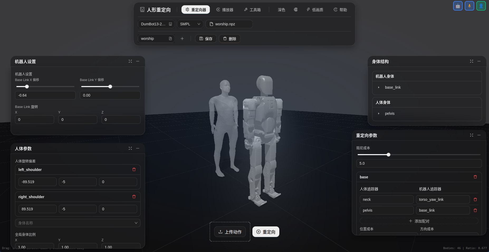

# Humanoid Retarget

[中文文档](README_zh.md)


A comprehensive system for retargeting human motion capture data to humanoid robots, featuring a web-based interface for visualization and configuration management.

## Overview

**Humanoid Retarget** is a full-stack application that converts human motion data (SMPL, BVH formats) into robot-executable motion trajectories using inverse kinematics optimization. The system consists of three main components:

- **Core Library** (`humanoid_retargeting`): Python library for motion alignment and retargeting
- **Web Backend** (`web_backend`): FastAPI server providing REST APIs for motion processing
- **Web Frontend** (`web_frontend`): React-based interactive interface for visualization and control



### Key Features

- Support for multiple motion capture formats (SMPL, BVH)
- IK-based motion retargeting with configurable optimization
- Real-time 3D visualization using MuJoCo
- Web-based configuration management
- Batch processing with multiprocessing support
- Extensible robot model system via `hurodes`

---

## Environment Setup

### Prerequisites

- **Python**: >= 3.9
- **Node.js**: >= 18.0
- **Conda/Mamba**: Recommended for Python environment management

### Backend Configuration

1. **Create Python Environment**

```bash
conda create -n humanoid-retarget python=3.9
conda activate humanoid-retarget
```

2. **Install Core Library**

```bash
cd /path/to/humanoid-retarget
pip install -e .
```

3. **Install Backend Dependencies**

```bash
pip install -r web_backend/requirements.txt
```

**Main Dependencies:**
- `mujoco`: Physics simulation and rendering
- `mink`: Inverse kinematics solver
- `hurodes`: Humanoid robot description system
- `fastapi`: Web framework
- `uvicorn`: ASGI server

### Frontend Configuration

1. **Install Node Dependencies**

```bash
cd web_frontend
npm install
```

**Main Dependencies:**
- `react`: UI framework
- `antd`: Component library
- `three.js`: 3D graphics
- `mujoco`: WebAssembly-based physics engine
- `axios`: HTTP client

---

## Data Storage

### Directory Structure

```
humanoid-retarget/
├── data/                          # Project data directory
│   ├── models/                    # Human body models
│   │   ├── smpl/                  # SMPL model files
│   │   ├── smplh/                 # SMPL+H model files
│   │   ├── smplx/                 # SMPL-X model files
│   │   └── dmpls/                 # DMP pose library
│   ├── motions/                   # Motion capture data
│   │   ├── smpl/                  # SMPL format (.npz)
│   │   └── bvh/                   # BVH format (.bvh)
│   └── configs/                   # Retargeting configurations
│       ├── {robot_name}/          # Per-robot configs
│       │   ├── smpl/              # SMPL retargeting configs
│       │   └── bvh/               # BVH retargeting configs
│       └── ...
├── retargeted/                    # Output directory for retargeted motions
└── humanoid_retargeting/          # Core library source code
```

### Data Formats

#### Motion Capture Data

**SMPL Format (`.npz`):**
```python
{
    'trans': np.ndarray,           # Root translation (N, 3)
    'poses': np.ndarray,           # Body poses (N, 72) - axis-angle
    'betas': np.ndarray,           # Shape parameters (10,)
    'mocap_framerate': float,      # Frame rate (e.g., 120.0)
    'gender': str                  # 'male', 'female', or 'neutral'
}
```

**BVH Format (`.bvh`):**
- Standard BVH hierarchy with joint rotations

#### Retargeted Robot Motion (`.npz`)

```python
{
    'root_trans': np.ndarray,      # Root translation (N, 3)
    'root_quat': np.ndarray,       # Root orientation (N, 4) - [w,x,y,z]
    'root_lin_vel': np.ndarray,    # Root linear velocity (body frame) (N, 3)
    'root_ang_vel': np.ndarray,    # Root angular velocity (body frame) (N, 3)
    'joint_pos': np.ndarray,       # Joint positions (N, ndof)
    'joint_vel': np.ndarray,       # Joint velocities (N, ndof)
    'framerate': float             # Target frame rate (e.g., 100.0)
    'frame': int                   # Number of frames (e.g., 1000)
}
```

---

## Quick Start

1. **Activate Environment**

```bash
conda activate humanoid-retarget
```

2. **Start Web Application**

```bash
# Start backend
cd /path/to/humanoid-retarget
python -m uvicorn web_backend.main:app --host 0.0.0.0 --port 8000 --reload

# Start frontend
cd web_frontend
npm run dev
```

Access the application at: http://localhost:5173

---

## Usage Guide

For detailed web frontend usage instructions, please refer to: [Web Frontend User Guide](web_frontend/USER_GUIDE_zh.md) or check the manual on the web interface.

---

## Contributing

See [CONTRIBUTION.md](CONTRIBUTION.md) for guidelines.

---

## License

This project is licensed under the MIT License.

---

## Citation

If you use this project in your research, please cite:

```bibtex
@software{humanoid_retarget,
  title = {Humanoid Retarget: A System for Human-to-Robot Motion Transfer},
  author = {Honglong Tian, Yumeng Zhang},
  year = {2026},
  url = {https://github.com/ZyuonRobotics/humanoid-retarget}
}
```

---

## Support

For issues and questions:
- GitHub Issues: https://github.com/ZyuonRobotics/humanoid-retarget/issues
