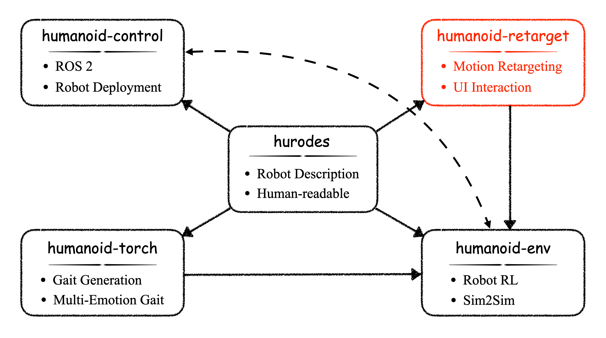
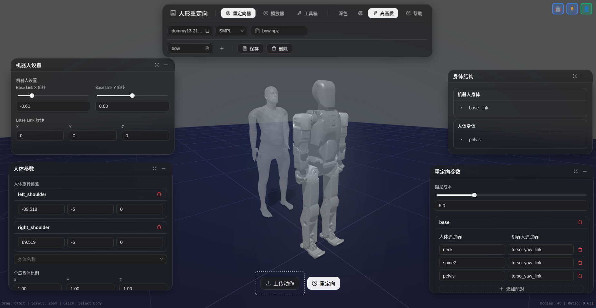

# Humanoid Retarget
[English](README.md)



一个将人体动作捕捉数据重定向到人形机器人的综合系统，具有基于 Web 的可视化界面和配置管理功能。

## 概述

**Humanoid Retarget** 是一个全栈应用程序，使用逆运动学优化将人体运动数据（SMPL、BVH 格式）转换为机器人可执行的运动轨迹。系统由三个主要组件组成：

- **核心库** (`humanoid_retargeting`)：用于运动对齐和重定向的 Python 库
- **Web 后端** (`web_backend`)：提供运动处理 REST API 的 FastAPI 服务器
- **Web 前端** (`web_frontend`)：基于 React 的交互式可视化和控制界面



### 主要特性

- 支持多种动作捕捉格式（SMPL、BVH）
- 基于 IK 的运动重定向，可配置优化参数
- 使用 MuJoCo 的实时 3D 可视化
- 基于 Web 的配置管理
- 支持多进程的批量处理
- 通过 `hurodes` 实现可扩展的机器人模型系统

---

## 环境配置

### 前置要求

- **Python**: >= 3.9
- **Node.js**: >= 18.0
- **Conda/Mamba**: 推荐用于 Python 环境管理

### 后端配置

1. **创建 Python 环境**

```bash
conda create -n humanoid-retarget python=3.9
conda activate humanoid-retarget
```

2. **安装核心库**

```bash
cd /path/to/humanoid-retarget
pip install -e .
```

3. **安装后端依赖**

```bash
pip install -r web_backend/requirements.txt
```

**主要依赖：**
- `mujoco`: 物理仿真和渲染
- `mink`: 逆运动学求解器
- `hurodes`: 人形机器人描述系统
- `fastapi`: Web 框架
- `uvicorn`: ASGI 服务器

### 前端配置

1. **安装 Node 依赖**

```bash
cd web_frontend
npm install
```

**主要依赖：**
- `react`: UI 框架
- `antd`: 组件库
- `three.js`: 3D 图形
- `mujoco`: 基于 WebAssembly 的物理引擎
- `axios`: HTTP 客户端

---

## 数据存储

### 目录结构

```
humanoid-retarget/
├── data/                          # 项目数据目录
│   ├── models/                    # 人体模型
│   │   ├── smpl/                  # SMPL 模型文件
│   │   ├── smplh/                 # SMPL+H 模型文件
│   │   ├── smplx/                 # SMPL-X 模型文件
│   │   └── dmpls/                 # DMP 姿态库
│   ├── motions/                   # 动作捕捉数据
│   │   ├── smpl/                  # SMPL 格式 (.npz)
│   │   └── bvh/                   # BVH 格式 (.bvh)
│   └── configs/                   # 重定向配置
│       ├── {robot_name}/          # 每个机器人的配置
│       │   ├── smpl/              # SMPL 重定向配置
│       │   └── bvh/               # BVH 重定向配置
│       └── ...
├── retargeted/                    # 重定向运动的输出目录
└── humanoid_retargeting/          # 核心库源代码
```

### 数据格式

#### 动作捕捉数据

**SMPL 格式 (`.npz`)：**
```python
{
    'trans': np.ndarray,           # 根节点平移 (N, 3)
    'poses': np.ndarray,           # 身体姿态 (N, 72) - 轴角表示
    'betas': np.ndarray,           # 形状参数 (10,)
    'mocap_framerate': float,      # 帧率（例如 120.0）
    'gender': str                  # 'male', 'female' 或 'neutral'
}
```

**BVH 格式 (`.bvh`)：**
- 标准 BVH 层次结构

#### 重定向后的机器人运动 (`.npz`)

```python
{
    'root_trans': np.ndarray,           # 根节点平移 (N, 3)
    'root_quat': np.ndarray,            # 根节点方向 (N, 4) - [w,x,y,z]
    'root_lin_vel': np.ndarray,         # 根线速度（自身系）(N, 3)
    'root_ang_vel': np.ndarray,         # 根角速度（自身系）(N, 3)
    'joint_pos': np.ndarray,            # 关节位置 (N, ndof)
    'joint_vel': np.ndarray,            # 关节速度 (N, ndof)
    'framerate': float                  # 目标帧率（例如 100.0）
    'frame': int                        # 帧数 (例如 1000)
}
```

---

## 快速启动

1. **激活环境**

```bash
conda activate humanoid-retarget
```

2. **启动网页端**

```bash
# 后端启动
cd /path/to/humanoid-retarget
python -m uvicorn web_backend.main:app --host 0.0.0.0 --port 8000 --reload

# 前端启动
cd web_frontend
npm run dev
```
在以下地址访问应用：http://localhost:5173

---

## 使用说明

详细的 Web 前端使用说明请参阅：[Web 前端使用指南](web_frontend/USER_GUIDE_zh.md)或参照网页端的手册

---

## 贡献

请参阅 [CONTRIBUTION.md](CONTRIBUTION.md) 了解指南。

---

## 许可证

本项目采用 MIT 许可证。

---

## 引用

如果您在研究中使用此项目，请引用：

```bibtex
@software{humanoid_retarget,
  title = {Humanoid Retarget: A System for Human-to-Robot Motion Transfer},
  author = {Honglong Tian, Yumeng Zhang},
  year = {2026},
  url = {https://github.com/ZyuonRobotics/humanoid-retarget}
}
```

---

## 支持

如有问题和疑问：
- GitHub Issues: https://github.com/ZyuonRobotics/humanoid-retarget/issues

