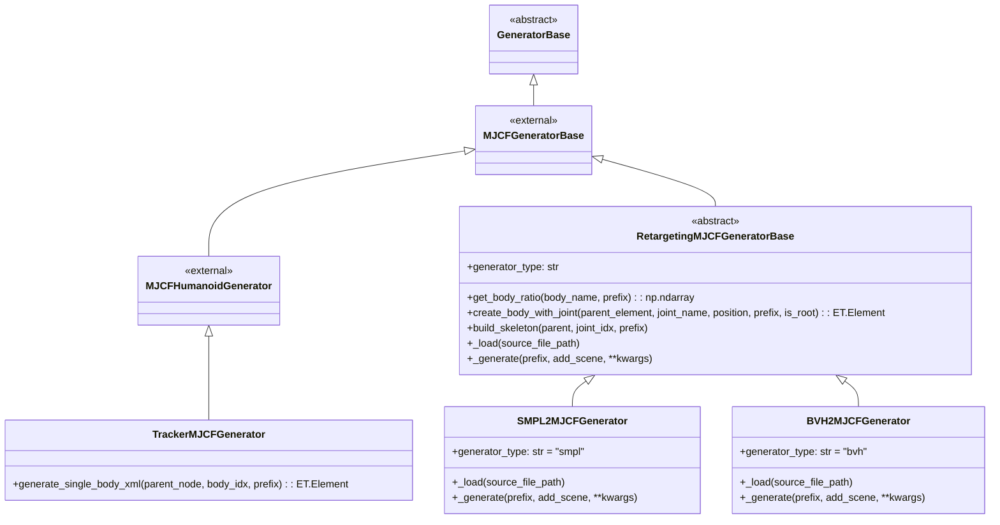

# MJCFGenerator类

Generator类负责生成可以用来仿真的机器人描述文件，在本项目中，将各种形式的动捕文件（SMPL，BVH等）以及机器人本身都用MJCF文件表示，并在mujoco中渲染仿真，因此`MJCFGenerator`类至关重要。

本项目中有三个`MJCFGenerator`类的子类，分别是：
- `SMPL2MJCFGenerator`：用于根据SMPL格式的动捕数据生成MJCF
- `BVH2MJCFGenerator`：用于根据BVH格式的动捕数据生成MJCF
- `TrackerMJCFGenerator`：基于HRDF机器人描述文件生成MJCF

其继承关系如下图所示：

## RetargetingMJCFGeneratorBase

`SMPL2MJCFGenerator`和`BVH2MJCFGenerator`都是`RetargetingMJCFGeneratorBase`的子类，它搭建了从动捕数据到mujoco之间的桥梁。其主要作用有：
- 自定义骨骼缩放：在retarget中往往需要根据机器人的身体比例对动捕数据中人形（即BVH或者SMPL中的“火柴人”）进行比例缩放。`RetargetingMJCFGeneratorBase`支持两种缩放：
    - 全局比例缩放：通过一组系数对全身所有骨骼进行等比例缩放，往往用于根据身高调整整体尺寸
    - 局部比例缩放：根据字典信息调整每一个骨骼的比例，用于对齐机器人和人形的局部比例差异
- 生成关节：SMPL和BVH都是通过若干个关节定义人形，`RetargetingMJCFGeneratorBase`使用mujoco中的`ball`关节对其进行定义
- 生成骨骼：通过在关节之间使用mujoco中的`capsule`（胶囊，形似圆柱体）进行连接，`RetargetingMJCFGeneratorBase`最终可以生成完整的火柴人结构

## SMPL2MJCFGenerator

`SMPL2MJCFGenerator`从SMPL格式的npz文件生成MJCF骨架。其`_load`方法的主要流程：

1. **格式识别**：根据`poses`的维度自动判断SMPL（24×3）或SMPLH（52×3/55×3）
2. **模型加载**：从SMPL/SMPLH模型文件中加载`kintree_table`（关节树）、`v_template`（模板顶点）、`shapedirs`（形状变形方向）、`J_regressor`（关节回归矩阵）等
3. **形状变形**：使用`betas`参数和`shapedirs`计算形状变形后的顶点位置：`vertices = v_template + shapedirs @ betas`
4. **关节位置计算**：使用`J_regressor`从变形后的顶点回归得到关节位置：`joint_positions = J_regressor @ vertices`
5. **关节偏移计算**：计算相邻关节间的相对偏移：`joint_offsets[1:] = joint_positions[1:] - joint_positions[parents[1:]]`
6. **坐标系转换**：将顶点从SMPL坐标系（Z-up）转换为mujoco坐标系（Y-up）：`vertices[:, :] = vertices[:, [2, 0, 1]]`

可选功能：当`generate_skin=True`时，`_generate`方法会在生成骨架后添加`<deformable>`和`<skin>`标签，将SMPL的网格模型作为可变形皮肤附加到骨架上，用于可视化。

## BVH2MJCFGenerator

`BVH2MJCFGenerator`通过解析BVH文件的HIERARCHY部分生成MJCF骨架。其`_load`方法的核心是递归解析BVH的层次结构：

1. **文件解析**：读取BVH文件直到`MOTION`行之前的所有内容，保留HIERARCHY部分
2. **递归解析**：`parse_joint`方法递归解析每个关节：
   - 解析关节名称（`ROOT`或`JOINT`）
   - 解析`OFFSET`字段，将偏移量除以100进行单位转换（从厘米转为米）
   - 解析`CHANNELS`字段（虽不直接使用，但需要解析）
   - 递归解析子关节和`End Site`
3. **End Site处理**：根据`parsing_end`参数决定是否将`End Site`解析为额外关节（命名规则：父关节名+`_bvhend`）

最终将解析结果转换为`joint_names`、`joint_parents`和`joint_offsets`数组，供基类的`build_skeleton`方法使用。

