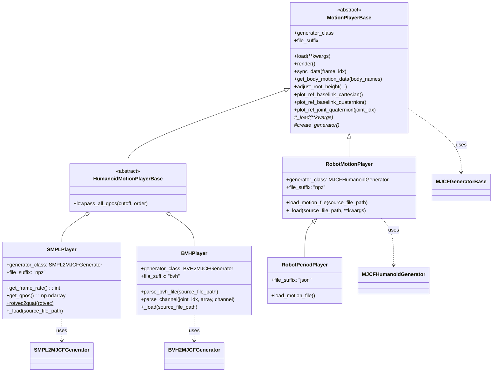

# MotionPlayer类

MotionPlayer类负责加载和播放动捕数据，在mujoco仿真器中可视化人形或机器人的运动。它将不同格式的动捕文件（SMPL、BVH等）或机器人动作数据转换为mujoco的qpos格式，并提供渲染、绘图等可视化功能。

本项目中的MotionPlayer类包括：
- `SMPLPlayer`：用于播放SMPL格式的动捕数据
- `BVHPlayer`：用于播放BVH格式的动捕数据
- `RobotMotionPlayer`：用于播放机器人动作数据
- `RobotPeriodPlayer`：用于生成和播放周期性机器人动作

其继承关系如下图所示：



## MotionPlayerBase

### 生命周期

一个MotionPlayer类在其生命周期之内主要有以下几个阶段：

- **构造（`__init__()`）**：通过外部参数构造实例，调用`create_generator()`创建generator，但不涉及任何数据加载。此时`_loaded=False`，`_model=None`，`_ref_qpos=None`。

- **加载（`load()`）**：将外部动捕数据加载进MotionPlayer类，基类`MotionPlayerBase`实现了`load(**kwargs)`函数，它会：
  1. 调用子类实现的`_load(**kwargs)`加载动捕数据（如poses、trans等），计算并设置`_ref_qpos`和`_frame_rate`
  2. 调用`generator.load(**kwargs)`加载模型数据（如SMPL模型文件、BVH骨架结构等）
  3. 将`_loaded`设置为`True`

- **模型生成（懒加载）**：mujoco模型的创建采用懒加载机制。当首次访问`model`属性时，会调用`generator.generate()`生成MJCF文件，然后创建`mujoco.MjModel`。这样可以避免在`load()`阶段生成模型，因为某些场景下可能只需要数据而不需要模型。

- **播放（`render()`）**：按帧率逐帧同步`ref_qpos`到`data.qpos`，并通过viewer实时渲染。如果`view=False`则不会显示可视化窗口。

- **关闭（`close()`）**：关闭viewer，释放可视化资源。

在实际使用中，可以先构造MotionPlayer类，再调用`load()`函数加载数据：
```
player = SMPLPlayer()
player.load(source_file_path="motion.npz")
player.render()
```

也可以使用`from_source_file_path`类方法，在构造的时候就完成加载：
```
player = SMPLPlayer.from_source_file_path("motion.npz")
player.render()
```

### 加载

基类`MotionPlayerBase`实现了`load(**kwargs)`函数，通常情况下子类只需要实现`_load(**kwargs)`，其中传入的参数`**kwargs`完全由`_load`处理。

MotionPlayer类有一个名为`_loaded`的属性，用于表示当前的实例是否已经加载了数据。当外部调用`load()`函数时，基类会自动将`_loaded`设置为`True`。调用`render()`、访问`model`和`data`属性时，都会断言`_loaded`的值为`True`。

在`HumanoidMotionPlayerBase`中，`load()`方法会先调用`generator.load()`加载模型数据，然后调用`_load()`加载动捕数据，最后对根节点位置应用`global_body_ratio`进行缩放。

### 模型生成

mujoco模型的创建采用懒加载机制，通过`@property`装饰的`model`属性实现。当首次访问`model`时：
1. 检查`generator.loaded`是否为`True`
2. 如果`_model`为`None`，调用`generator.generate()`生成MJCF文件
3. 使用`mujoco.MjModel.from_xml_string(generator.xml_str)`创建模型

同样，`data`属性也是懒加载的，首次访问时会基于`model`创建`mujoco.MjData`。

这种设计避免了在`load()`阶段生成模型，因为某些场景下可能只需要`ref_qpos`数据而不需要模型（例如进行数据分析、绘图等操作）。

### 核心功能

`MotionPlayerBase`提供了播放动捕数据的核心功能：

- **懒加载机制**：`model`和`data`属性采用懒加载，只有在首次访问时才调用`generator.generate()`生成MJCF并创建mujoco模型，避免在`load()`阶段生成
- **播放循环**：`render()`方法按帧率逐帧同步`ref_qpos`到`data.qpos`，并通过viewer实时渲染
- **数据分析**：`get_body_motion_data()`方法遍历所有帧，计算指定body的位置、姿态和速度数据
- **高度调整**：`adjust_root_height()`方法根据双脚的运动状态（低速度、低角速度、平坦pitch）自动计算并调整根节点高度，确保脚部接触地面
- **可视化工具**：提供多个plot方法用于绘制根节点位置、四元数、欧拉角以及关节四元数

## HumanoidMotionPlayerBase

`HumanoidMotionPlayerBase`是人形动捕播放器的基类，它扩展了`MotionPlayerBase`：

- **身体比例缩放**：在`load()`方法中，对根节点位置（`ref_qpos[:, :3]`）应用`global_body_ratio`进行缩放，用于匹配机器人尺寸
- **低通滤波**：`lowpass_all_qpos()`方法对位置和所有关节的四元数进行低通滤波，用于平滑运动数据，减少噪声

## SMPLPlayer

`SMPLPlayer`从SMPL格式的npz文件加载并播放动捕数据。其`_load`和`get_qpos`方法的主要流程：

1. **文件加载**：从npz文件加载`motion_data`，提取`poses`（旋转向量）和`trans`（根节点平移）
2. **帧率提取**：从`motion_data`中读取`mocap_frame_rate`或`mocap_framerate`
3. **坐标系转换**：将根节点位置从SMPL坐标系转换到mujoco坐标系：`trans += model.body("pelvis").pos[[1, 2, 0]]`，并将除根节点外的旋转向量从`[x,y,z]`转换为`[z,x,y]`
4. **旋转向量转四元数**：使用`scipy.spatial.transform.Rotation.from_rotvec()`将旋转向量转换为四元数，并通过`np.roll(..., shift=1)`调整顺序为`[w,x,y,z]`
5. **根节点四元数转换**：根节点的四元数需要额外乘以转换矩阵`mat`，以适配mujoco的坐标系
6. **qpos组装**：将平移、根节点四元数和所有关节四元数按mujoco的qpos格式组装

## BVHPlayer

`BVHPlayer`通过解析BVH文件的MOTION部分加载并播放动捕数据。其核心是`parse_bvh_file`和`parse_channel`方法：

1. **文件解析**：读取BVH文件，找到`Frame Time:`行提取帧率，然后解析后续所有帧的运动数据
2. **通道解析**：`parse_channel`方法解析每个关节的CHANNELS：
   - 分离位置通道（如`Xposition`）和旋转通道（如`Xrotation`）
   - 位置数据除以100进行单位转换（厘米转米），并按`[X,Y,Z]`顺序重组
   - 旋转数据使用`Rotation.from_euler()`按BVH的旋转顺序（如`ZXY`）转换为四元数
3. **根节点处理**：当`rotating_baselink=True`时，对根节点的位置和旋转应用90度X轴旋转，将BVH的坐标系转换到mujoco坐标系
4. **qpos组装**：根节点包含位置和四元数，其他关节只包含四元数，按mujoco格式组装

## RobotMotionPlayer

`RobotMotionPlayer`用于播放预处理的机器人动作数据。它直接使用`MJCFHumanoidGenerator`（而非`RetargetingMJCFGeneratorBase`）来生成机器人模型。

- **数据格式**：从npz文件加载`root_trans`、`root_quat`和`joint_pos`三个数组，直接拼接成qpos格式
- **模型生成**：调用`generator.generate(relative_mesh_path=False)`生成机器人MJCF文件

## RobotPeriodPlayer

`RobotPeriodPlayer`从JSON配置文件生成周期性的机器人动作（如步态），用于测试和演示。

1. **配置解析**：从JSON文件加载配置，包括步态周期、腿部/手臂关节的scale/offset参数、高度、双足支撑阈值等
2. **正弦波生成**：根据`stepping_period`生成正弦波，并根据`double_support_threshold`将其分割为左右脚的支撑/摆动相
3. **关节角度计算**：对每个腿部关节（hip、knee、ankle）和手臂关节（shoulder、elbow），使用`scale * wave + offset`计算角度
4. **左右对称**：左腿和右腿使用相反的波形，手臂关节的运动与腿部运动方向相反

